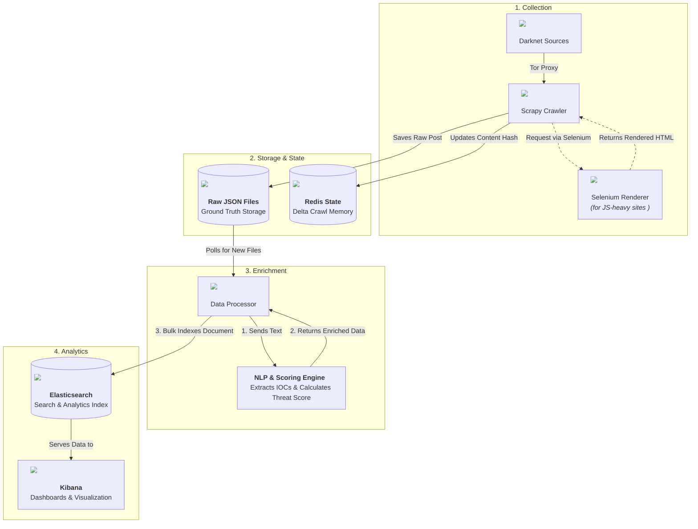

<div align="center">

# 🕵️ Darknet CTI Platform  

**Automated pipeline for crawling darknet forums, enriching content with NLP, and transforming it into actionable Cyber Threat Intelligence (CTI).** 


</div>

---

## 🚨 Why It Matters 

This platform automates the entire CTI lifecycle: from ethical collection on darknet forums and leak sites, to NLP-driven enrichment that extracts critical indicators, to real-time visualization in an interactive dashboard. It is designed to save analyst hours and accelerate threat discovery.

✅ Crawl darknet/deep web forums (Tor + Selenium capable)  
✅ Extract per-post content (author, metadata, text, links, images)  
✅ Enrich with NLP (IOCs, CVEs, malware families, threat actors, leaks)  
✅ Apply threat scoring & geo inference  
✅ Index directly into Elasticsearch for Kibana dashboards  

---

## ⚙️ Project Flow


> Note: Selenium is only invoked for pages requiring dynamic JavaScript rendering. Network traffic still routes through the Tor/Privoxy proxy layer when enabled; Selenium is not part of the core pipeline path for static/HTML-friendly forums.

### 🔑 Key Features
- Per-post granularity → fine CTI extraction, not just thread dumps
- Rich IOC coverage → IPs, domains, hashes, CVEs, crypto wallets, emails
- Threat actor & malware family tagging → YAML-driven rules
- Threat scoring → combines CVEs, malware, actor mentions, leak signals
- Config-driven onboarding → add new sites without code changes
- Resilience → handles Elasticsearch downtime gracefully

## 🚀 Quick Start
```bash
git clone https://github.com/eyakadri/darknet-cti-platform.git
cd darknet-cti-platform

# (Optional) Create & activate virtual environment
python -m venv .venv
source .venv/bin/activate

pip install -r requirements.txt
python -m spacy download en_core_web_sm

# Start Elasticsearch + Kibana (runs in background)
docker compose up -d

# Crawl darknet data
python scripts/run_crawler.py

# Process + enrich crawled data (batch mode)
python scripts/run_processor.py batch
```
Then open http://localhost:5601 and create a data view for the index: `cti_intelligence`.

### 🧪 Run Tests
```bash
pytest -q
```

### 📦 Dependencies
Core: Scrapy, spaCy, Elasticsearch client, (optional) Selenium for dynamic pages.

### 📊 Kibana
After data flows into `cti_intelligence`, build dashboards around:
- IOC frequency over time
- Top mentioned CVEs / malware families
- Actor & forum source distribution
- Threat score trends

### 🧭 Roadmap (Ideas)
- Add YARA rule extraction
- Model-based entity linking for actor aliases
- ML-based leak detection classifier
- Stream (near‑real‑time) mode via Kafka

### ❗ Ethics & Security
This project is intended for research & academic use only.
Use responsibly and ensure you have authorization before crawling.
Handle potentially sensitive data with care.
Comply with all applicable laws and institutional policies.

---

🔥 From noisy darknet chatter → to structured CTI insights in your dashboards.