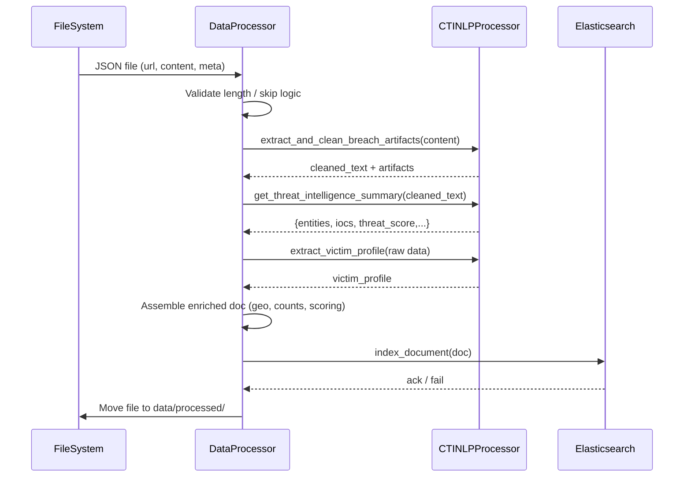
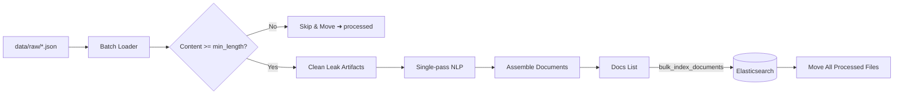
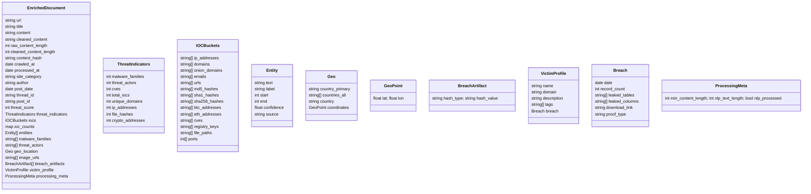
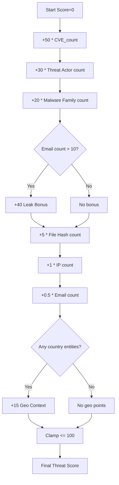
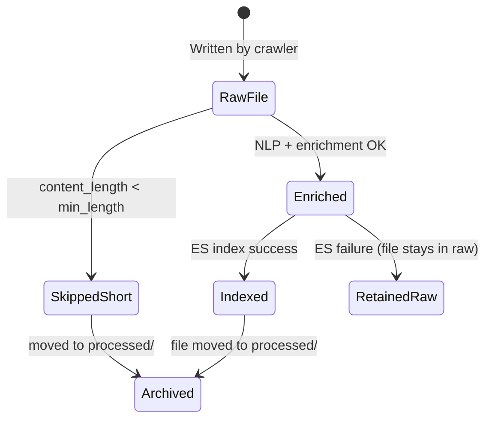
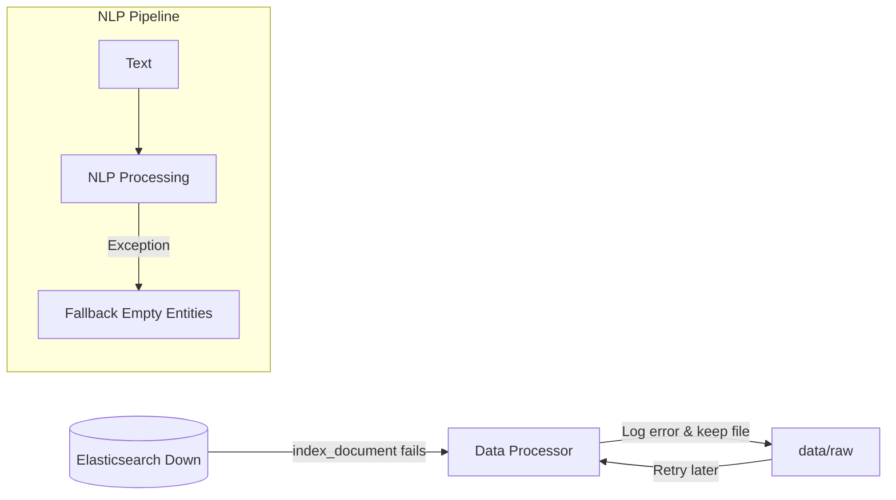
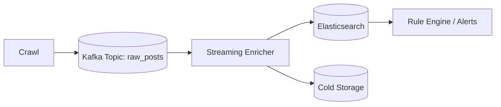

# Darknet CTI Platform – Visual Architecture

This document provides visual representations (Mermaid + ASCII) of the system's data flow, component interactions, and processing lifecycle. Use these diagrams in docs, presentations, or onboarding.

---
## 1. End-to-End Data Flow (High-Level)
```mermaid
graph LR
    A[Hidden / Darknet Sites <br/> forums, markets, blogs] -->|HTTP / Tor| B[Scrapy Crawler <br/> DarknetSpider]
    B -->|Raw Post JSON<br/> data/raw/*.json| C[Filesystem Handoff]
    C --> D[Data Processor <br/> consumer/data_processor.py]
    D -->|spaCy + Regex| E[NLP Processor <br/> CTINLPProcessor]
    E --> D
    D -->|Enriched Document| F[(Elasticsearch <br/> cti_intelligence)]
    F --> G[Kibana / Dashboards]
    F --> H[Grafana (optional)]
    F --> I[Future APIs / Exports]
```

---
## 2. Scrapy Crawler Internal Flow
```mermaid
flowchart TD
    A[Start Crawl] --> B[Load crawler_config.yaml]
    B --> C{Target Site Loop}
    C --> D[Request Listing / Index Page]
    D --> E[Parse Links / Pagination]
    E --> F[Fetch Post Page]
    F --> G[Extract Fields (author, date, content, images, IDs)]
    G --> H[Compute content_hash]
    H --> I{Duplicate?
(redis state + session memory)}
    I -- Yes --> J[Skip Persist]
    I -- No --> K[Emit Item]
    K --> L[Item Pipelines]
    L --> M[Write JSON to data/raw]
    J --> C
    M --> C
    C --> N[End]
```

---
## 3. Data Processor Sequence (Single File)


---
## 4. Bulk Batch Mode Workflow


---
## 5. Elasticsearch Document Logical Model


---
## 6. Threat Scoring Logic (Decision View)


---
## 7. Processing State Transitions


---
## 8. Resilience & Degradation Paths


---
## 9. Future Streaming Extension (Concept)


---
## 10. ASCII Quick Reference (Compact)
```
[Tor+Scrapy] -> data/raw/*.json -> (DataProcessor)
    -> NLP (entities+iocs+score)
    -> Elasticsearch(cti_intelligence) -> Kibana/Grafana

Failure: ES down => file stays in raw for retry.
```

---
## Usage
Embed any diagram in other Markdown:
```markdown

```
Regenerate as architecture evolves.

---
Maintained: 2025-09-28
